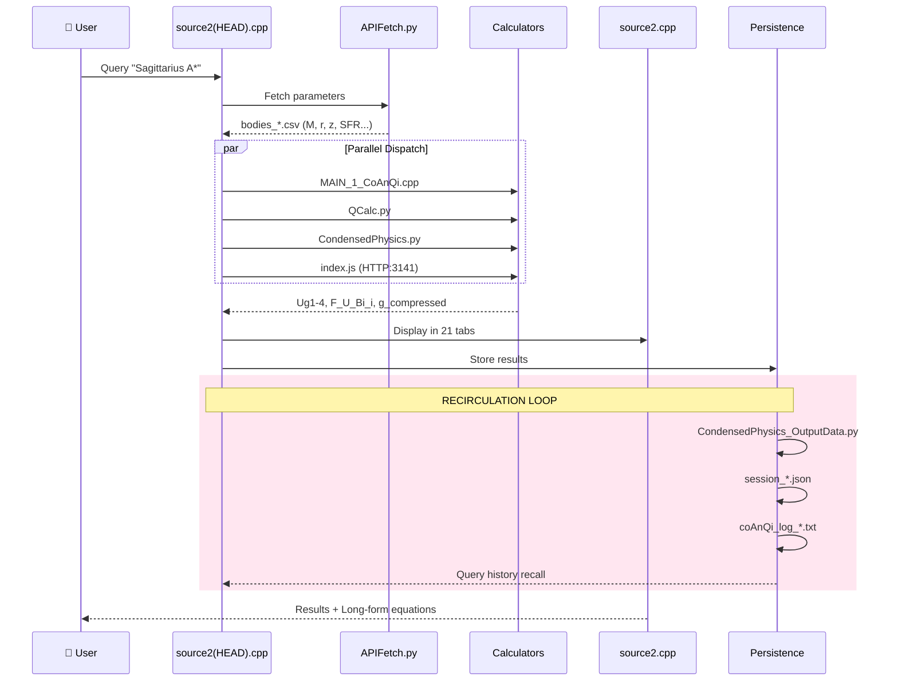
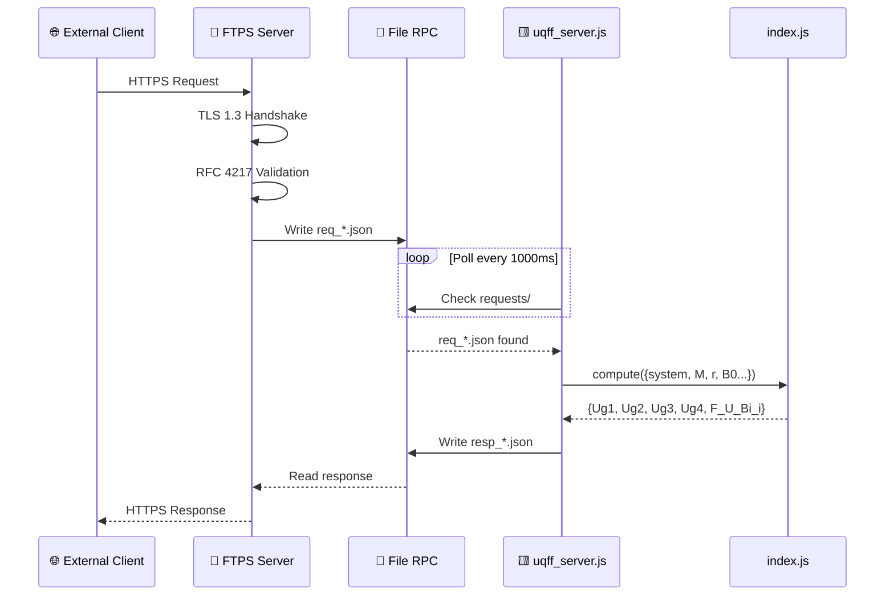

# UQFF Star-Magic Full Workflow Diagram

## Complete System Architecture

```mermaid
flowchart TB
    subgraph EXTERNAL["🌐 EXTERNAL USER INTERFACE"]
        USER[("👤 User Query<br/>Web/CLI/API")]
    end

    subgraph FTPS_LAYER["🔐 FTPS SECURITY LAYER (Port 990/21)"]
        FTPS_SERVER["FTPS Server<br/>RFC 4217 + TLS 1.3"]
        FTPS_CLIENT["uqff_ftps_client.py<br/>890+ lines"]
    end

    subgraph FILE_RPC["📁 FILE-BASED RPC"]
        REQ_DIR[("./uqff_data/requests/<br/>req_*.json")]
        RESP_DIR[("./uqff_data/responses/<br/>resp_*.json")]
    end

    subgraph JS_ENGINE["🟨 JAVASCRIPT ENGINE"]
        UQFF_SERVER["uqff_server.js<br/>HTTP Port 3141<br/>REST API + File Polling"]
        INDEX_JS["index.js<br/>23,790 lines<br/>106 systems<br/>Ug1-4, F_U_Bi_i"]
    end

    subgraph HEAD_PROGRAM["🎯 source2(HEAD PROGRAM).cpp - ORCHESTRATOR"]
        QUERY_FIELD["📝 USER QUERY FIELD<br/>'Sagittarius A*', 'M87', 'NGC 3596'..."]
        API_FETCH["🔍 APIFetch.py<br/>SIMBAD → NASA → Grok"]
        BODIES_CSV[("bodies_YYYYMMDD.csv")]
        DISPATCH["⚡ DISPATCH TO CALCULATORS"]
        AGGREGATE["📊 RESULTS AGGREGATION"]
    end

    subgraph CALCULATORS["🧮 COMPUTATION ENGINES"]
        MAIN1["MAIN_1_CoAnQi.cpp<br/>107,019 lines<br/>446 modules<br/>100 systems"]
        QCALC["QCalc.py<br/>9,100+ lines<br/>8 equations"]
        CONDENSED["CondensedPhysics.py<br/>5,500+ lines<br/>Pure calculator"]
        JS_HTTP["index.js via HTTP<br/>uqff_server.js:3141"]
    end

    subgraph SOURCE2_GUI["🖥️ source2.cpp - QT GUI APPLICATION"]
        direction TB
        MAINWINDOW["MainWindow<br/>11,058 lines"]
        
        subgraph TABS["📑 21 TABS"]
            TAB1["Tab 1: 🎛️ MAIN_1 Calculator"]
            TAB2["Tab 2: 🐍 QCalc.py"]
            TAB3["Tab 3: 🧮 Scientific Calc"]
            TAB4["Tab 4: 📓 Notebook"]
            TAB5["Tab 5: 📚 CondensedPhysics"]
            TAB6["Tab 6: 🤖 CoAnQi_bot"]
            TAB7["Tab 7: 🧠 SuperGrok4"]
            TAB8["Tab 8: 🌌 UQFF 3D Simulator"]
            TAB9["Tab 9: 📋 Session Logger"]
            TAB10["Tab 10: ⚖️ Compare C++/Python"]
            TAB11["Tab 11: 📐 Equation Display"]
            TAB12["Tab 12: 🌐 JS Engine"]
        end
        
        subgraph WIDGETS["🧩 ENHANCED WIDGETS"]
            EQ_RENDER["equation_renderer.h<br/>IPC to QCalc.py"]
            JS_WIDGET["UQFFJavaScriptWidget<br/>HTTP to uqff_server.js"]
            SESSION["SessionPersistence"]
        end
    end

    subgraph PERSISTENCE["💾 RECIRCULATION PERSISTENCE LOOP"]
        OUTPUT_DATA["CondensedPhysics_OutputData.py"]
        SESSION_JSON[("session_*.json")]
        COAQ_LOG[("coAnQi_log_*.txt")]
        HISTORY["Query History<br/>Available for Recall"]
    end

    subgraph SHARED["🔗 SHARED CONSTANTS"]
        CONST_H["shared_constants.h<br/>UQFF:: namespace"]
        CONST_PY["shared_constants.py<br/>UQFFConstants"]
        CONST_JS["index.js constants"]
    end

    %% External FTPS Flow
    USER -->|"HTTPS"| FTPS_SERVER
    FTPS_SERVER -->|"TLS 1.3"| FTPS_CLIENT
    FTPS_CLIENT -->|"Write"| REQ_DIR
    REQ_DIR -->|"Poll"| UQFF_SERVER
    UQFF_SERVER --> INDEX_JS
    INDEX_JS -->|"Compute"| RESP_DIR
    RESP_DIR -->|"Read"| FTPS_CLIENT
    FTPS_CLIENT -->|"Return"| FTPS_SERVER
    FTPS_SERVER -->|"HTTPS"| USER

    %% Local GUI Flow
    QUERY_FIELD --> API_FETCH
    API_FETCH --> BODIES_CSV
    BODIES_CSV --> DISPATCH
    DISPATCH --> MAIN1
    DISPATCH --> QCALC
    DISPATCH --> CONDENSED
    DISPATCH --> JS_HTTP
    MAIN1 --> AGGREGATE
    QCALC --> AGGREGATE
    CONDENSED --> AGGREGATE
    JS_HTTP --> AGGREGATE

    %% Results to GUI
    AGGREGATE --> MAINWINDOW
    MAINWINDOW --> TABS
    TAB11 --> EQ_RENDER
    TAB12 --> JS_WIDGET
    EQ_RENDER -->|"IPC"| QCALC
    JS_WIDGET -->|"HTTP:3141"| UQFF_SERVER

    %% Persistence Loop
    AGGREGATE --> OUTPUT_DATA
    AGGREGATE --> SESSION_JSON
    AGGREGATE --> COAQ_LOG
    OUTPUT_DATA --> HISTORY
    SESSION_JSON --> TAB9
    HISTORY -->|"Recall"| QUERY_FIELD

    %% Cross-validation
    MAIN1 <-->|"Compare"| QCALC
    TAB10 --> MAIN1
    TAB10 --> QCALC

    %% Shared Constants
    CONST_H --> MAIN1
    CONST_H --> SOURCE2_GUI
    CONST_PY --> QCALC
    CONST_PY --> CONDENSED
    CONST_JS --> INDEX_JS

    %% Styling
    classDef external fill:#e1f5fe,stroke:#01579b
    classDef ftps fill:#fff3e0,stroke:#e65100
    classDef js fill:#fff9c4,stroke:#f9a825
    classDef cpp fill:#e8f5e9,stroke:#2e7d32
    classDef python fill:#e3f2fd,stroke:#1565c0
    classDef gui fill:#f3e5f5,stroke:#7b1fa2
    classDef persist fill:#fce4ec,stroke:#c2185b
    classDef shared fill:#eceff1,stroke:#37474f

    class USER external
    class FTPS_SERVER,FTPS_CLIENT ftps
    class UQFF_SERVER,INDEX_JS,JS_HTTP,JS_WIDGET js
    class MAIN1,SOURCE2_GUI,MAINWINDOW cpp
    class QCALC,CONDENSED,API_FETCH python
    class TABS,WIDGETS gui
    class OUTPUT_DATA,SESSION_JSON,COAQ_LOG,HISTORY persist
    class CONST_H,CONST_PY,CONST_JS shared
```



## Data Flow Summary



## FTPS Bridge Flow



## Component Legend

| Icon | Component | Language | Lines | Purpose |
|------|-----------|----------|-------|---------|
| 🎯 | source2(HEAD PROGRAM).cpp | C++ | ~3,000 | Query orchestrator |
| 🖥️ | source2.cpp | C++/Qt | 11,058 | GUI application (21 tabs) |
| 🎛️ | MAIN_1_CoAnQi.cpp | C++ | 107,019 | Primary UQFF calculator |
| 🐍 | QCalc.py | Python | 9,100+ | Unified field solver |
| 📚 | CondensedPhysics.py | Python | 5,500+ | Pure physics calculator |
| 🟨 | index.js | JavaScript | 23,790 | 106-system engine |
| 🌐 | uqff_server.js | JavaScript | 504 | REST API + File RPC |
| 🔐 | uqff_ftps_client.py | Python | 890+ | FTPS client (RFC 4217) |
| 📐 | equation_renderer.h | C++ | 790 | Long-form equation display |
| 🧩 | source2_widgets_enhanced.h | C++ | 897+ | Enhanced GUI widgets |

## Port Assignments

| Port | Service | Protocol | Description |
|------|---------|----------|-------------|
| 990 | FTPS Implicit | TLS | External secure transfers |
| 21 | FTPS Explicit | STARTTLS | External (upgrade to TLS) |
| 3141 | uqff_server.js | HTTP | Internal REST API (π×1000) |

## Environment Variables

```bash
# uqff_server.js
UQFF_PORT=3141
UQFF_HOST=127.0.0.1
UQFF_FILE_RPC=true
UQFF_REQUEST_DIR=./uqff_data/requests
UQFF_RESPONSE_DIR=./uqff_data/responses

# uqff_ftps_client.py
UQFF_FTPS_HOST=ftps.example.com
UQFF_FTPS_PORT=990
UQFF_FTPS_IMPLICIT=true
UQFF_FTPS_VERIFY=true

# Grok AI
XAI_API_KEY=your_key
```

---
**View this diagram:** Open in VS Code with Mermaid preview extension, or paste into [mermaid.live](https://mermaid.live)
