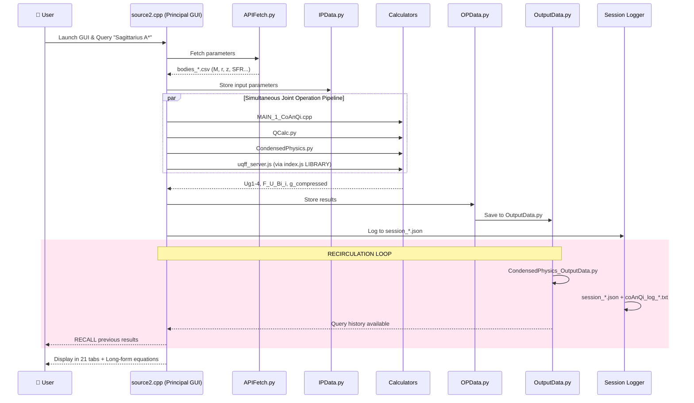
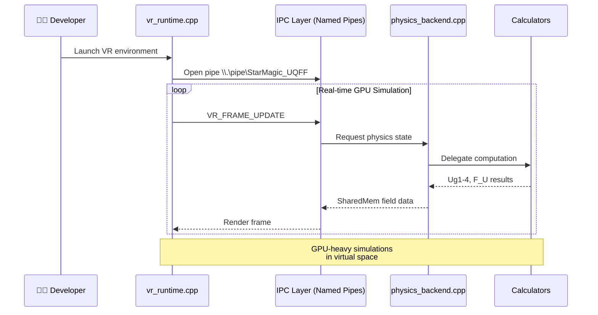
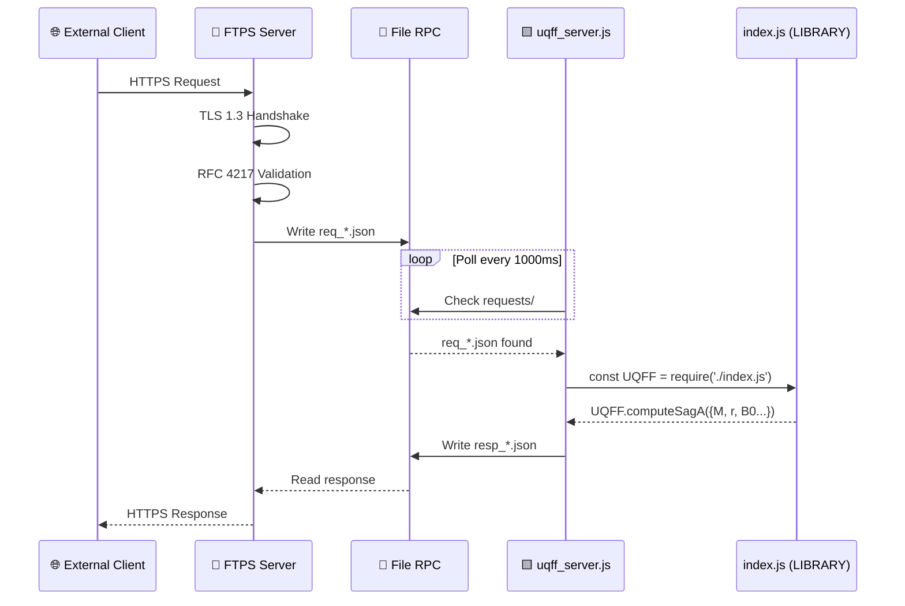

# UQFF Star-Magic Full Workflow Diagram

> **Version:** 2.0 CANONICAL (matches ARCHITECTURE_FLOW_DIAGRAM.md v4.0)
> **CRITICAL:** source2.cpp = PRINCIPAL GUI (FIRST), VR/VM = Developer Backend

## Complete System Architecture

```mermaid
flowchart TB
    subgraph EXTERNAL["🌐 EXTERNAL USER INTERFACE"]
        USER[("👤 User Query<br/>Web/CLI/API")]
    end

    subgraph FTPS_LAYER["🔐 FTPS SECURITY LAYER (Port 990/21)"]
        FTPS_SERVER["FTPS Server<br/>RFC 4217 + TLS 1.3"]
        FTPS_CLIENT["uqff_ftps_client.py<br/>890+ lines"]
    end

    subgraph FILE_RPC["📁 FILE-BASED RPC"]
        REQ_DIR[("./uqff_data/requests/<br/>req_*.json")]
        RESP_DIR[("./uqff_data/responses/<br/>resp_*.json")]
    end

    subgraph JS_LIBRARY["🟨 JAVASCRIPT LIBRARY LAYER"]
        UQFF_SERVER["uqff_server.js<br/>HTTP Port 3141<br/>REST API + File Polling"]
        INDEX_JS["index.js<br/>23,790 lines<br/>LIBRARY INDEX<br/>(NOT a calculator)"]
    end

    subgraph PRINCIPAL_GUI["🖥️ source2.cpp - PRINCIPAL GUI (USER STARTS HERE)"]
        direction TB
        MAINWINDOW["MainWindow<br/>11,058 lines<br/>Qt6 + VTK + Chromium"]
        
        QUERY_FIELD["📝 USER QUERY FIELD<br/>'Sagittarius A*', 'M87', 'NGC 3596'..."]
        API_FETCH["🔍 APIFetch.py<br/>55 APIs: SIMBAD → NASA → Grok"]
        BODIES_CSV[("bodies_YYYYMMDD.csv")]
        DISPATCH["⚡ DISPATCH TO CALCULATORS"]
        
        subgraph TABS["📑 21 TABS"]
            TAB1["Tab 1: 🎛️ MAIN_1 Calculator"]
            TAB2["Tab 2: 🐍 QCalc.py"]
            TAB3["Tab 3: 🧮 Scientific Calc"]
            TAB4["Tab 4: 📓 Notebook"]
            TAB5["Tab 5: 📚 CondensedPhysics"]
            TAB6["Tab 6: 🤖 CoAnQi_bot"]
            TAB7["Tab 7: 🧠 SuperGrok4"]
            TAB8["Tab 8: 🌌 UQFF 3D Simulator"]
            TAB9["Tab 9: 📋 Session Logger"]
            TAB10["Tab 10: ⚖️ Compare C++/Python"]
            TAB11["Tab 11: 📐 Equation Display"]
            TAB12["Tab 12-21: 🌐 JS Engines"]
        end
        
        AGGREGATE["📊 RESULTS AGGREGATION"]
    end

    subgraph CALCULATORS["🧮 CALCULATOR ECOSYSTEMS"]
        MAIN1["MAIN_1_CoAnQi.cpp<br/>107,019 lines | 446 modules<br/>15+ headers"]
        QCALC["QCalc.py<br/>9,100+ lines | 16 programs"]
        CONDENSED["CondensedPhysics.py<br/>81,626 lines | 12+ programs"]
        JS_HTTP["uqff_server.js:3141<br/>(imports index.js LIBRARY)"]
    end

    subgraph VR_BACKEND["🥽 VR/VM BACKEND (DEVELOPER SIDE - GPU HEAVY)"]
        VR_RUNTIME["vr_runtime.cpp<br/>Virtual space, keyboard, goggles"]
        PHYSICS_BACKEND["physics_backend.cpp<br/>CPU-bound physics server"]
        IPC_LAYER["IPC Layer<br/>Named Pipes + SharedMem + gRPC<br/>\\.\pipe\StarMagic_UQFF"]
    end

    subgraph PERSISTENCE["💾 RECIRCULATION PERSISTENCE LOOP"]
        IPDATA["IPData.py<br/>431 lines"]
        OPDATA["OPData.py<br/>327 lines"]
        OUTPUT_DATA["CondensedPhysics_OutputData.py<br/>RECALL STORAGE"]
        SESSION_JSON[("session_*.json")]
        COAQ_LOG[("coAnQi_log_*.txt")]
        UQFF_RESULTS[("uqff_results.json")]
        HISTORY["Query History<br/>Available for Recall"]
    end

    subgraph SHARED["🔗 SHARED CONSTANTS"]
        CONST_H["shared_constants.h<br/>UQFF:: namespace<br/>351 lines"]
        CONST_PY["shared_constants.py<br/>250 lines"]
        CONST_JS["index.js CONSTANTS"]
    end

    %% External FTPS Flow
    USER -->|"HTTPS"| FTPS_SERVER
    FTPS_SERVER -->|"TLS 1.3"| FTPS_CLIENT
    FTPS_CLIENT -->|"Write"| REQ_DIR
    REQ_DIR -->|"Poll"| UQFF_SERVER
    UQFF_SERVER -->|"require()"| INDEX_JS
    INDEX_JS -->|"Return"| UQFF_SERVER
    UQFF_SERVER -->|"Compute"| RESP_DIR
    RESP_DIR -->|"Read"| FTPS_CLIENT
    FTPS_CLIENT -->|"Return"| FTPS_SERVER
    FTPS_SERVER -->|"HTTPS"| USER

    %% USER STARTS HERE - Principal GUI Flow
    USER -->|"Launch"| MAINWINDOW
    MAINWINDOW --> QUERY_FIELD
    QUERY_FIELD --> API_FETCH
    API_FETCH --> BODIES_CSV
    BODIES_CSV --> IPDATA
    IPDATA --> DISPATCH
    
    %% Parallel Dispatch to Calculators
    DISPATCH --> MAIN1
    DISPATCH --> QCALC
    DISPATCH --> CONDENSED
    DISPATCH --> JS_HTTP
    
    %% Results aggregation
    MAIN1 --> AGGREGATE
    QCALC --> AGGREGATE
    CONDENSED --> AGGREGATE
    JS_HTTP --> AGGREGATE
    
    %% VR Backend IPC (Developer Side)
    IPC_LAYER <-->|"Named Pipe"| PHYSICS_BACKEND
    IPC_LAYER <-->|"SharedMem"| VR_RUNTIME
    DISPATCH -.->|"Optional IPC"| IPC_LAYER

    %% Results to Tabs
    AGGREGATE --> TABS
    TAB11 -.->|"IPC"| QCALC
    TAB12 -.->|"HTTP:3141"| UQFF_SERVER

    %% Persistence Loop (RECIRCULATION)
    AGGREGATE --> OPDATA
    OPDATA --> UQFF_RESULTS
    UQFF_RESULTS --> OUTPUT_DATA
    AGGREGATE --> SESSION_JSON
    AGGREGATE --> COAQ_LOG
    OUTPUT_DATA --> HISTORY
    SESSION_JSON --> TAB9
    HISTORY -->|"RECALL"| QUERY_FIELD

    %% Cross-validation between calculators
    MAIN1 <-->|"Compare"| QCALC
    TAB10 --> MAIN1
    TAB10 --> QCALC

    %% Shared Constants
    CONST_H --> MAIN1
    CONST_H --> PRINCIPAL_GUI
    CONST_PY --> QCALC
    CONST_PY --> CONDENSED
    CONST_JS --> INDEX_JS

    %% Styling
    classDef external fill:#e1f5fe,stroke:#01579b
    classDef ftps fill:#fff3e0,stroke:#e65100
    classDef js fill:#fff9c4,stroke:#f9a825
    classDef cpp fill:#e8f5e9,stroke:#2e7d32
    classDef python fill:#e3f2fd,stroke:#1565c0
    classDef gui fill:#f3e5f5,stroke:#7b1fa2
    classDef persist fill:#fce4ec,stroke:#c2185b
    classDef shared fill:#eceff1,stroke:#37474f
    classDef vr fill:#ffe0b2,stroke:#e65100

    class USER external
    class FTPS_SERVER,FTPS_CLIENT ftps
    class UQFF_SERVER,INDEX_JS,JS_HTTP js
    class MAIN1,PRINCIPAL_GUI,MAINWINDOW cpp
    class QCALC,CONDENSED,API_FETCH,IPDATA,OPDATA python
    class TABS gui
    class OUTPUT_DATA,SESSION_JSON,COAQ_LOG,HISTORY,UQFF_RESULTS persist
    class CONST_H,CONST_PY,CONST_JS shared
    class VR_RUNTIME,PHYSICS_BACKEND,IPC_LAYER vr
```



## Data Flow Summary



## VR/VM Backend Flow (Developer Side)



## FTPS Bridge Flow



## Component Legend

| Icon | Component | Language | Lines | Purpose |
|------|-----------|----------|-------|---------|
| 🖥️ | source2.cpp | C++/Qt6 | 11,058 | **PRINCIPAL GUI** (user starts here) |
| 🎛️ | MAIN_1_CoAnQi.cpp | C++ | 107,019 | Primary UQFF calculator (446 modules) |
| 🐍 | QCalc.py | Python | 9,100+ | Unified field solver (16 associated programs) |
| 📚 | CondensedPhysics.py | Python | 81,626 | Pure physics calculator (12+ programs) |
| 🟨 | index.js | JavaScript | 23,790 | **LIBRARY INDEX** (NOT a calculator) |
| 🌐 | uqff_server.js | JavaScript | 504 | REST API (imports index.js library) |
| 🔐 | uqff_ftps_client.py | Python | 890+ | FTPS client (RFC 4217) |
| 🥽 | vr_runtime.cpp | C++ | ~5K | VR/VM GPU runtime (developer side) |
| ⚙️ | physics_backend.cpp | C++ | ~12K | CPU-bound physics server |
| 🔗 | ipc/uqff_ipc.h | C++ | 403 | IPC layer (Named Pipes, SharedMem) |

## Port Assignments

| Port | Service | Protocol | Description |
|------|---------|----------|-------------|
| 990 | FTPS Implicit | TLS | External secure transfers (TLS from start) |
| 21 | FTPS Explicit | STARTTLS | External (upgrade to TLS) |
| 3141 | uqff_server.js | HTTP | REST API (π×1000) |
| 8443 | QCalc_API.py | HTTPS | FastAPI (optional) |
| N/A | Named Pipe | IPC | \\.\pipe\StarMagic_UQFF |
| N/A | SharedMemory | IPC | Low-latency VR frame data |

## Calculator Ecosystems (Associated Programs)

### QCalc.py Ecosystem (16 programs)
- QCalc_API.py, QCalc_Advanced.py, QCalc_validation.py, QCalc_test.py
- QCalc_stat.py, QCalc_stat_test.py, QCalc_Performance.py
- QCalc_core_uqff.py, QCalc_cpp_equations.py, QCalc_cpp_extracted.py
- QCalc_js_extracted.py, QCalc_extracted.py, QCalc_Wolfram_Extensions.py
- QCalc_Phase1_Validation.py, QCalc_test_SOURCE16_50.py

### CondensedPhysics.py Ecosystem (12+ programs)
- CondensedPhysics_InputData.py, CondensedPhysics_OutputData.py
- CondensedPhysics_Validation.py, Phase5_Consolidated.py
- Phase6_Consolidated.py, Phase7_Consolidated.py
- IPData.py, OPData.py, InputData.py, OutputData.py
- CoAnQi_Wrapper.py, shared_constants.py

### MAIN_1_CoAnQi.cpp Ecosystem (15+ headers)
- shared_constants.h, observational_systems_config.h, MUGE.h
- uqff_self_expanding.h, uqff_dual_physics.h, uqff_tracing.h
- uqff_cross_platform.h, uqff_constants.h, wolfram_wstp_runtime.h
- UQFFResultsWidget.h, UQFFSource10.h, FluidSolver.h
- CelestialBody.h, csv_body_reader.h, UnitTests.h

### index.js Library (LIBRARY INDEX - not a calculator)
- uqff_server.js (REST API using the library)
- automated_legacy_converter.js
- Usage: `const UQFF = require('./index.js'); UQFF.computeSagA(params);`

## Environment Variables

```bash
# uqff_server.js
UQFF_PORT=3141
UQFF_HOST=127.0.0.1
UQFF_FILE_RPC=true
UQFF_REQUEST_DIR=./uqff_data/requests
UQFF_RESPONSE_DIR=./uqff_data/responses

# uqff_ftps_client.py
UQFF_FTPS_HOST=ftps.example.com
UQFF_FTPS_PORT=990
UQFF_FTPS_IMPLICIT=true
UQFF_FTPS_VERIFY=true

# Grok AI
XAI_API_KEY=your_key
```

---
**CANONICAL DOCUMENT** - Version 2.0 - Matches ARCHITECTURE_FLOW_DIAGRAM.md v4.0
**View this diagram:** Open in VS Code with Mermaid preview extension, or paste into [mermaid.live](https://mermaid.live)
